# How Codex Workflow Runner Works

This document explains the implementation and operating model of
`codex-workflow-runner`: how a workflow script is parsed, sandboxed, executed,
persisted, resumed, and delegated to native Codex subagents.

The runner lives mainly in:

```text
codex-workflow-runner/
|-- SKILL.md
|-- scripts/
|   |-- codex_workflow_runner.mjs
|   `-- vendor/acorn.mjs
|-- tests/
|   `-- parser.test.mjs
`-- references/
```

At a high level, a user or parent Codex session writes a plain JavaScript
workflow. The runner executes that script in a locked VM, and each `agent()`
call becomes a real Codex subagent. The parent runner keeps the state, budget,
agent limit, journals, snapshots, and synthesis result.

## Mental Model

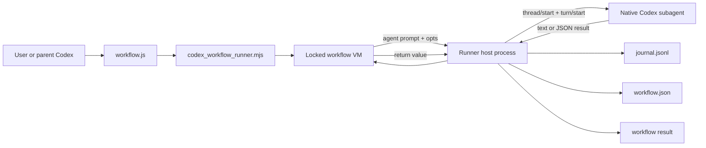

The important separation is:

- The workflow script decides control flow: phases, pipelines, parallel fan-out,
  loops, child workflows, and final return value.
- The runner host owns side effects: Codex subagent execution, app-server
  lifecycle, snapshots, journal cache, budget, agent limit, worktrees, and CLI
  output.
- The VM is deterministic and intentionally weak: it cannot read files directly,
  call timers, use `Math.random()`, or inspect the system except through
  `agent()`, `workflow()`, `log()`, `phase()`, `args`, `cwd`, and `budget`.

## Command Surface

The CLI exposes four main commands.

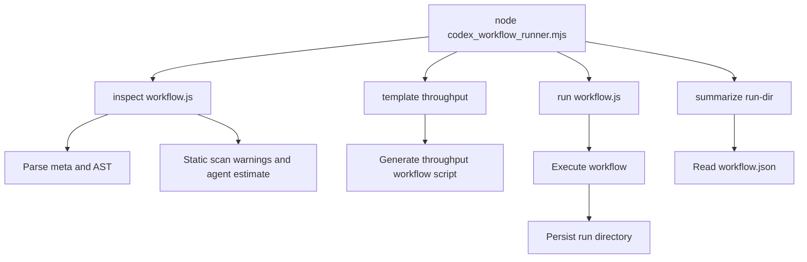

### `inspect`

`inspect` parses the workflow with Acorn, validates the literal `meta` block,
walks the AST, and reports:

- `agent()` calls.
- `parallel()` calls.
- `pipeline()` calls.
- loop calls.
- `.map()` fan-out calls.
- dynamic agent calls under fan-out contexts.
- worktree isolation usage.
- unsupported isolation modes.
- determinism warnings such as `Date.now()`, `Math.random()`, or argless
  `new Date()`.

This is a static preview only. The final authoritative counts are written to
`workflow.json` after a run.

### `template throughput`

`template throughput` writes a starter workflow that uses the common:

```text
Assess -> Verify -> Synthesize
```

shape for throughput investigations. It is a convenience generator, not a
separate execution mode.

### `run`

`run` executes a workflow, writes a run directory, dispatches subagents, and
stores the final result.

Common flags:

```bash
node codex_workflow_runner.mjs run workflow.js \
  --workspace "$PWD" \
  --sandbox read-only \
  --transport appserver \
  --max-concurrency 8 \
  --max-agents 1000 \
  --budget-tokens 200000
```

### `summarize`

`summarize` reads a prior run's `workflow.json` and returns status, counts,
token totals, and result.

## Run Directory Layout

Each run writes a stable artifact directory:

```text
.codex-workflows/
`-- wf_<id>/
    |-- workflow.json
    |-- workflows/
    |   `-- scripts/
    |       `-- <workflow-name>-wf_<id>.js
    |-- subagents/
    |   `-- workflows/
    |       `-- wf_<id>/
    |           |-- journal.jsonl
    |           |-- agent-<id>.meta.json
    |           |-- agent-<id>.final.txt
    |           |-- agent-<id>.jsonl
    |           |-- agent-<id>.stderr.txt
    |           |-- agent-<id>.schema.json
    |           |-- agent-<id>.worktree.patch
    |           `-- agent-<id>.worktree.json
    `-- children/
        `-- wf_<child-id>/
            `-- workflow.json
```

Not every file exists for every transport:

- App-server agents write `meta.json` and `final.txt`.
- Exec fallback agents also write `jsonl`, `stderr.txt`, and optional
  `schema.json`.
- Worktree agents write patch and worktree metadata.
- Child workflows write nested run directories under `children/`.

## Script Contract

Every workflow is plain JavaScript. The first statement must be a literal:

```js
export const meta = {
  name: 'review-changes',
  description: 'Review a change set',
  whenToUse: 'When a diff needs independent review',
  phases: [
    { title: 'Review', detail: 'parallel reviewers' },
    { title: 'Verify', detail: 'skeptical validation' },
    { title: 'Synthesize', detail: 'final result' },
  ],
}
```

The runner strips the `export const meta` declaration and executes the remaining
body inside an async wrapper.

Supported workflow globals:

```text
agent(prompt, opts)
parallel(thunks)
pipeline(items, ...stages)
phase(title)
log(message)
workflow(ref, args)
args
cwd
process.cwd()
budget
structuredClone()
console.log()
```

Blocked or constrained behavior:

- No TypeScript syntax.
- No `require`.
- No filesystem APIs from inside the workflow script.
- No timers.
- No argless `Date()` or `new Date()`.
- No `Date.now()`.
- No `Math.random()`.
- No dynamic code generation inside the VM.

The script's returned JSON-serializable value becomes `workflow.json.result`.

## Static Parsing And Inspection

The parser uses the vendored Acorn module. It validates the header before any
workflow code runs.

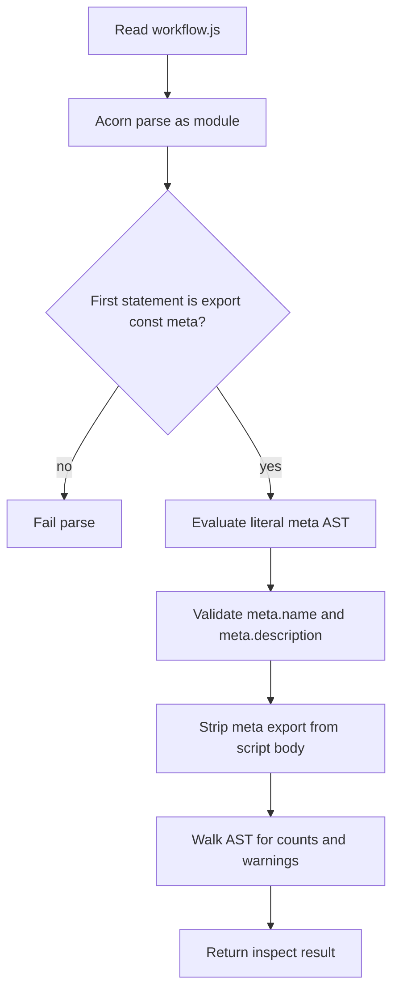

The `meta` object is intentionally pure. The literal evaluator rejects:

- spreads.
- computed keys.
- function calls.
- methods or accessors.
- template interpolation.
- sparse arrays.
- reserved keys like `__proto__`, `constructor`, and `prototype`.

That keeps inspection deterministic and prevents workflow metadata from running
arbitrary code.

## Execution Architecture

The runner has two layers in one Node module:

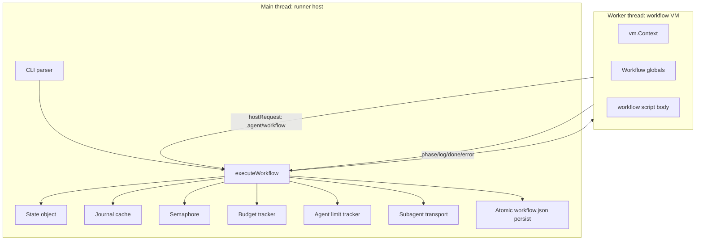

Why the split exists:

- The workflow script must be sandboxed and deterministic.
- The host must still perform real side effects such as launching Codex,
  writing snapshots, and managing worktrees.
- The worker communicates with the host through `postMessage` requests.

The host starts a `worker_threads.Worker` in `mode: 'workflow-vm'`. The worker
creates a locked `vm.Context`, defines the workflow DSL, wraps the script body
as:

```js
(async () => {
  // stripped workflow body
})()
```

and returns the final result to the host.

## Host To VM Bridge

Inside the VM, `agent()` and `workflow()` are async functions that call back to
the host. The bridge serializes plain JSON values so the VM cannot share host
objects.

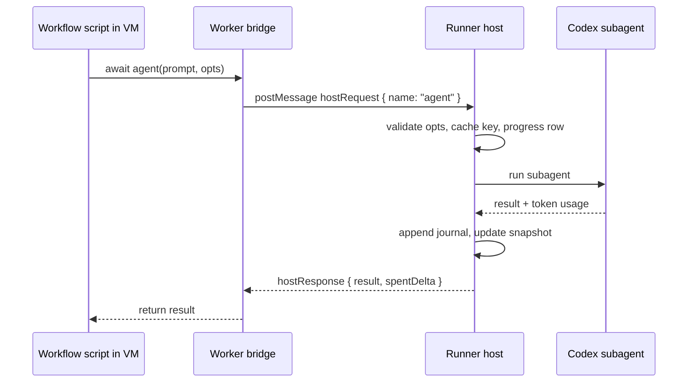

`phase()` and `log()` are simpler one-way messages:

- `phase(title)` updates the current phase and progress grouping.
- `log(message)` appends a timestamped log entry to the snapshot.

## Workflow VM Sandbox

The VM context is created with string and WASM code generation disabled:

```js
vm.createContext(bindings, {
  codeGeneration: { strings: false, wasm: false },
})
```

Then the runner defines a small global surface and removes the bridge internals.

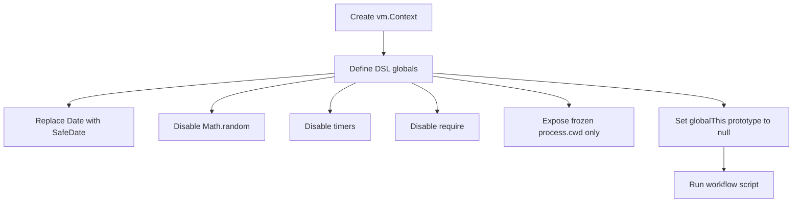

The timeout model has two pieces:

- Synchronous script execution must yield within `WORKFLOW_SYNC_TIMEOUT_MS`
  milliseconds.
- Subagent turns have a longer app-server turn timeout controlled by
  `CODEX_WF_TURN_TIMEOUT_MS`.

The sync watchdog prevents a workflow body from blocking the worker forever with
a CPU-bound loop before any awaited host call.

## State Snapshot

The host keeps an in-memory `state` object and writes it atomically to
`workflow.json`. Each persist writes to a temp file and renames it into place.

Important snapshot fields:

```text
runId
taskId
workflowName
summary
whenToUse
script
scriptPath
status
startTime
durationMs
phases
workflowProgress
agentCount
totalTokens
totalToolCalls
logs
result
args
workspace
sandbox
transport
schemaRetries
childModel
budgetTokens
agentLimit
defaultModel
timestamp
error
```

`workflowProgress` contains two kinds of rows:

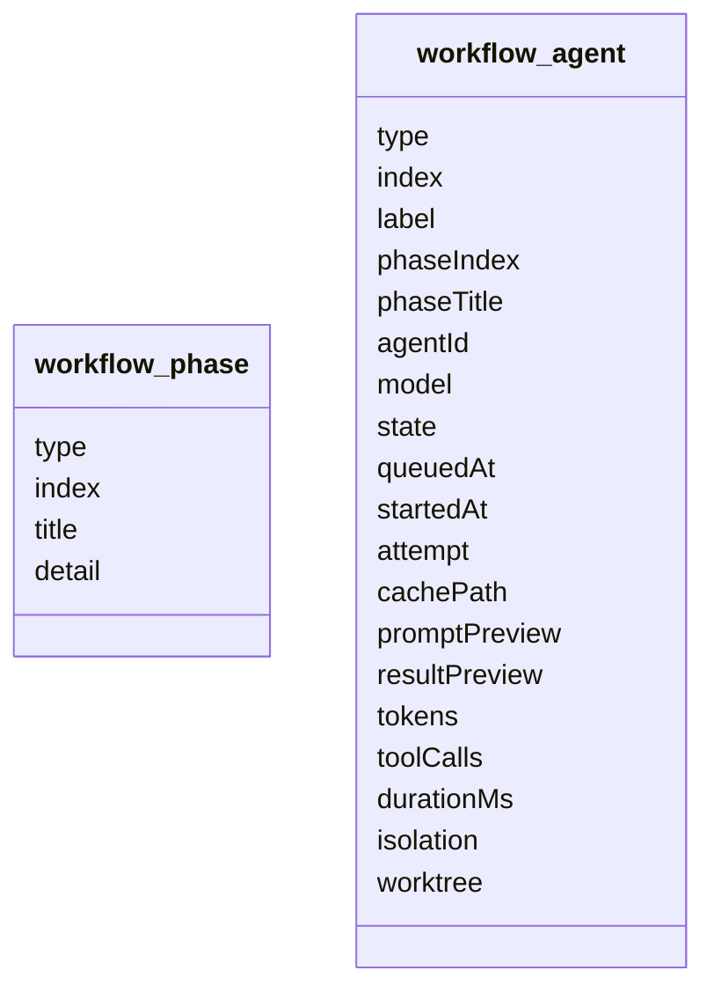

Agent states move through:

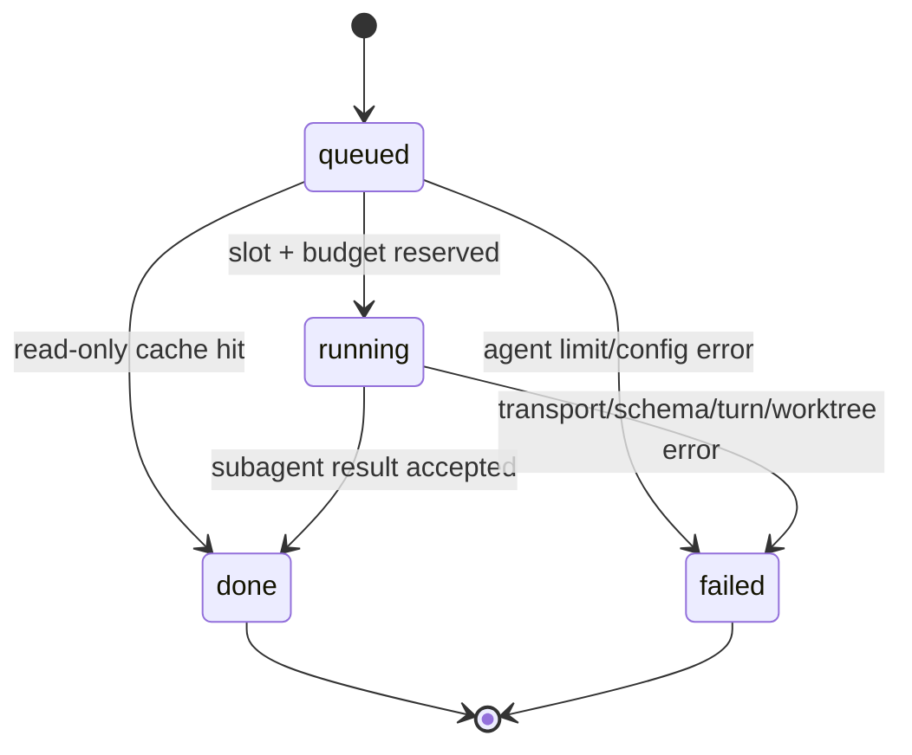

## Agent Call Lifecycle

The host implementation of `agent(prompt, opts)` is the core of the runner.

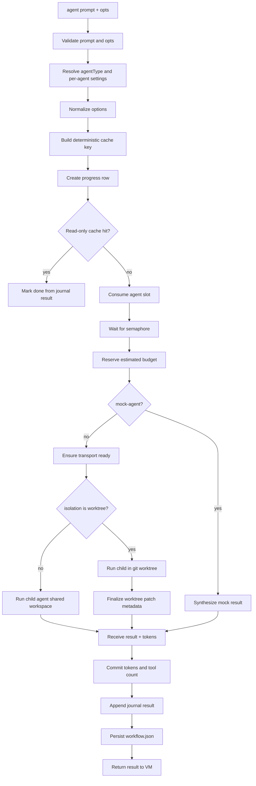

The agent options supported by the runner are:

```js
{
  label: 'short progress label',
  phase: 'phase title',
  schema: { type: 'object' },
  model: 'model override',
  effort: 'low',
  instructions: 'developer instructions for this subagent',
  agentType: 'explorer',
  mcpServers: { name: { command, args, env } },
  tools: { name: { command, args, env } },
  isolation: 'worktree',
  cacheKey: 'optional explicit stable key',
}
```

`model`, `instructions`, and `effort` override settings from `agentType`.
`mcpServers` and `tools` are aliases for per-agent MCP server definitions.

## Cache Keys And Resume

Read-only runs can replay cached agent results from `journal.jsonl`.

Journal event shape:

```json
{"type":"started","key":"v2:<hash>","agentId":"a123"}
{"type":"result","key":"v2:<hash>","agentId":"a123","result":{"ok":true}}
```

Agent cache keys include:

- call path.
- workspace.
- whether `--mock-agent` was used.
- prompt.
- normalized options.
- resolved agent profile digest.

The call path is crucial. It keeps repeated identical prompts inside loops,
`parallel()`, or `pipeline()` from collapsing into one cache entry.

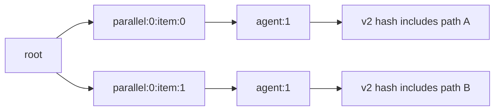

Resume behavior:

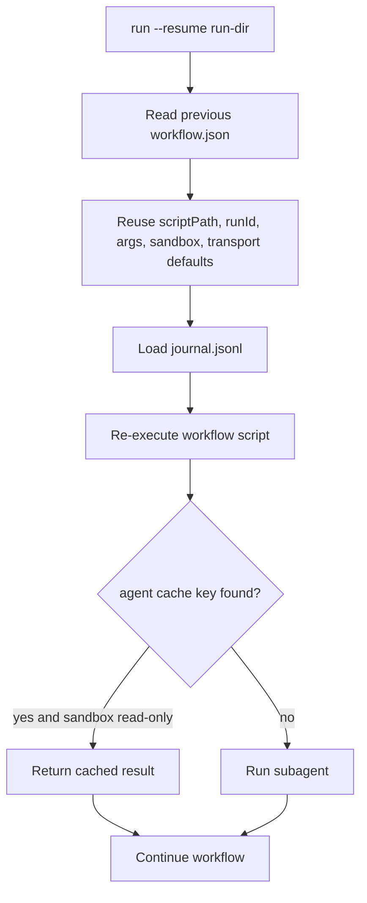

Only `read-only` sandbox runs use the cache. Mutating runs are replayed by
rerunning agents, because cached mutation would not recreate filesystem state.

## Budget And Agent Limits

The runner has two safety counters:

- `--budget-tokens`: a run-wide token budget exposed as `budget.total`.
- `--max-agents`: a lifetime cap on agent calls, defaulting to 1000.

Budget flow:

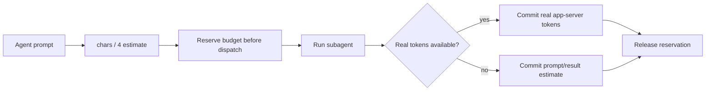

The app-server transport reports real token usage through
`thread/tokenUsage/updated`. The exec and mock paths fall back to a character
estimate.

Agent limit flow:

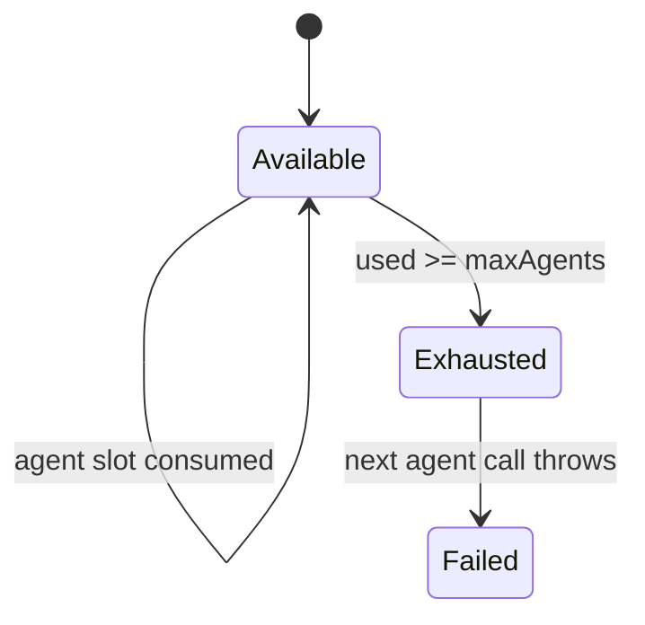

Cached replay can also count against the limit, unless the resumed snapshot
already persisted agent usage.

## Concurrency

`--max-concurrency` controls a simple semaphore around real agent execution.
Progress rows can be queued before they actually run.

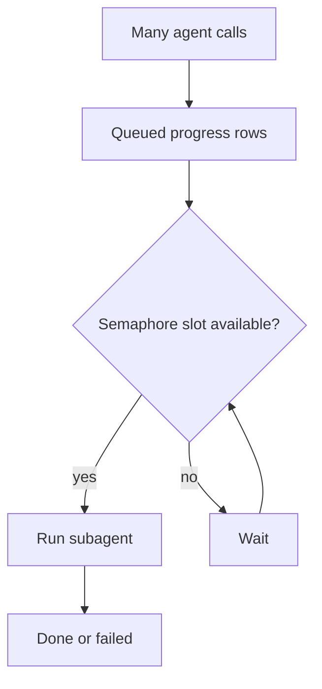

`parallel()` and `pipeline()` decide how many promises are created. The host
semaphore decides how many actual subagents may execute at once.

## `parallel()` Versus `pipeline()`

`parallel(thunks)` is a barrier. It receives functions, starts them together,
and returns results in input order. If a thunk throws, that slot becomes `null`.

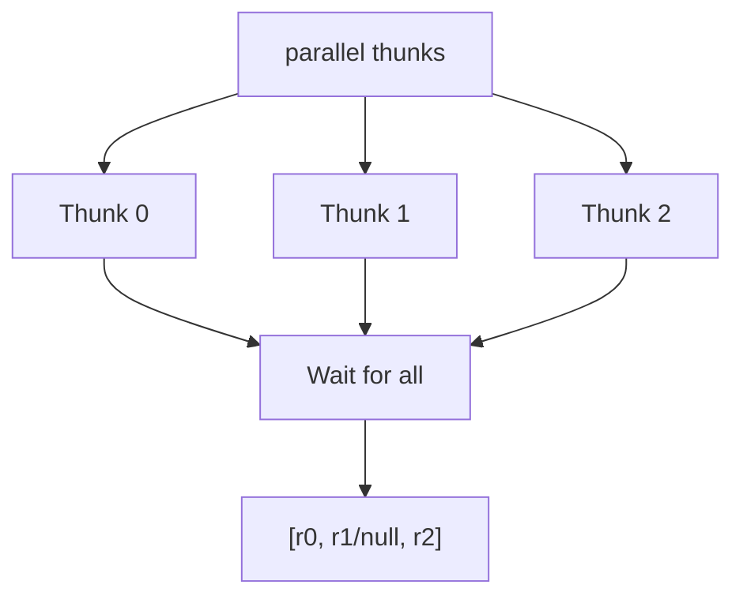

`pipeline(items, ...stages)` has no barrier between stages. Each item moves
through all stages independently. A thrown stage or explicit `null` drops only
that item.

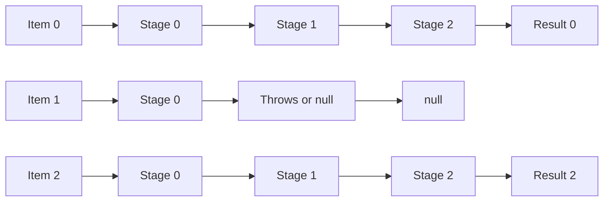

Use `pipeline()` when each item can advance independently. Use `parallel()` when
you need a barrier, such as deduping across all findings before verification.

## App-Server Transport

The default transport is `--transport appserver`. The runner starts one
long-lived `codex app-server` process lazily, on the first real agent that is
not satisfied by cache.

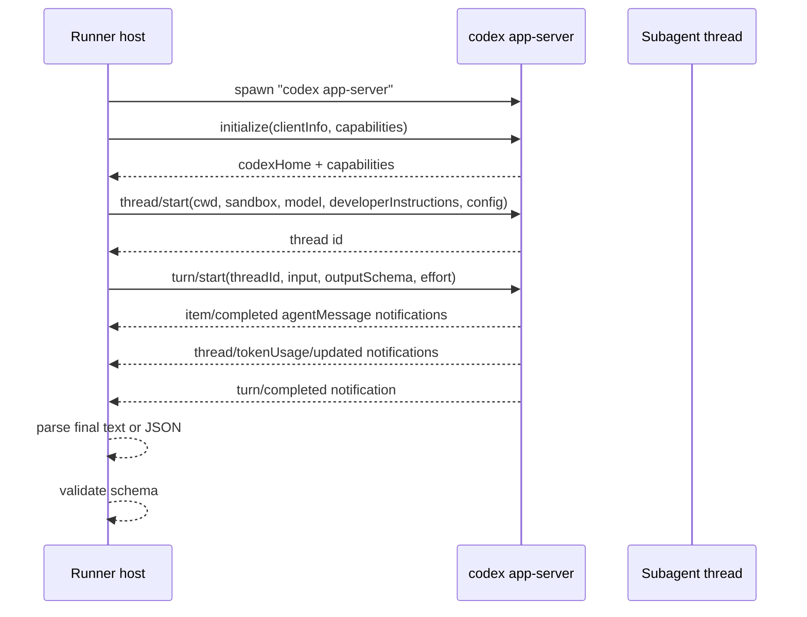

App-server advantages:

- One process for the whole run.
- Real Codex subagent threads.
- Native `outputSchema` on `turn/start`.
- Real token accounting.
- Per-agent model, effort, developer instructions, sandbox, and MCP config.
- Subagents inherit configured Codex MCP servers.

The runner sets `approvalPolicy: 'never'` and auto-declines unexpected
server-to-client requests so a headless run cannot hang on an approval prompt.

If the app-server fails to initialize, the runner logs the failure, stops the
process if needed, switches `state.transport` to `exec`, persists the snapshot,
and uses the fallback for the rest of the run.

## Exec Fallback Transport

The exec transport runs one `codex exec` process per agent.

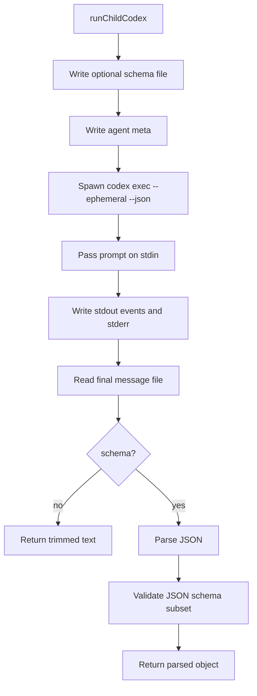

Exec fallback folds per-agent developer instructions into the prompt. It can
pass model and effort flags, but it cannot bridge `mcpServers` or MCP-declaring
agent profiles. Those require app-server transport.

## Structured Output

Structured agents pass a JSON Schema through `opts.schema`.

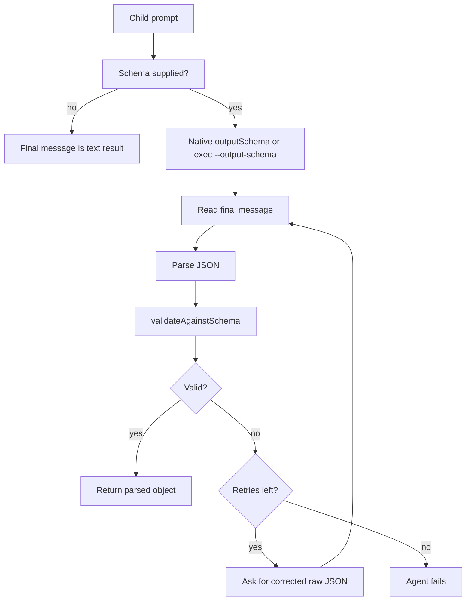

The local schema validator supports the subset used by workflow schemas:

- `type`.
- `enum`.
- `const`.
- `required`.
- `properties`.
- `additionalProperties: false`.
- array `items`.

The runner treats schema compliance as shape validation, not truth validation.
Workflows should still include verifier agents or external commands for
substantive correctness.

## Child Prompt Framing

Before dispatch, every child prompt is wrapped with a return-value contract:

- The child is told it is an isolated subagent in a parent workflow.
- The child is told its final message is consumed programmatically.
- Structured children must return raw JSON only.
- Text children must return a complete self-contained answer.
- Labels and phase names are included when available.

This makes child output suitable for programmatic composition instead of a
human conversation.

## Agent Profiles And MCP

`agentType` can be:

- `default`.
- `worker`.
- `explorer`.
- a `.codex/agents/<name>.toml` profile in the workspace.
- a `.codex/agents/<name>.toml` profile in `CODEX_HOME`.
- a `.codex/agents/<name>.toml` profile in the user's home `.codex`.

The minimal TOML reader supports the subset needed by Codex agent profiles:

```toml
model = "gpt-5.4"
model_reasoning_effort = "high"
sandbox_mode = "read-only"
developer_instructions = """
Review like an owner.
Prioritize correctness.
"""

[mcp_servers.fs]
command = "npx"
args = ["-y", "server-filesystem", "/tmp"]
```

Resolution flow:

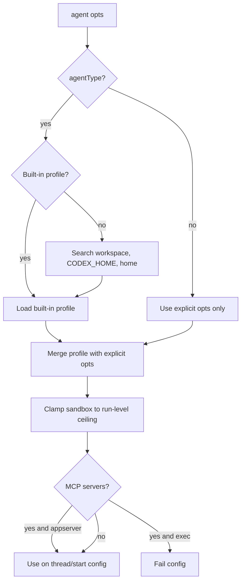

Sandbox clamping means a profile can narrow permissions, but it cannot escalate
beyond the run's `--sandbox` setting.

## Worktree Isolation

`agent(prompt, { isolation: 'worktree' })` runs a mutating child inside a
temporary detached git worktree.

```mermaid
flowchart TD
  A[Worktree agent requested] --> B[Find git root]
  B --> C[Assert parent tree clean outside runner outputs]
  C --> D[Create temp directory]
  D --> E[git worktree add --detach at HEAD]
  E --> F[Run child agent in child workspace]
  F --> G[git add -N .]
  G --> H[Capture status, diff, diffstat]
  H --> I{Changed?}
  I -- no --> J[Remove unchanged worktree]
  I -- yes --> K[Keep changed worktree]
  J --> L[Write .worktree.patch and .worktree.json]
  K --> L
  L --> M[Return child result and worktree metadata]
```

There is no automatic merge. The patch is captured for the parent or an
integrator to inspect and apply.

The parent workspace must be clean outside runner output directories, because
the runner needs a trustworthy base commit and patch.

## Child Workflows

`workflow(ref, args)` runs another workflow script from inside a workflow. It is
limited to one nesting level.

```mermaid
flowchart TD
  Parent[Parent workflow VM] --> Call[workflow child.js]
  Call --> Host[Parent host workflow function]
  Host --> Key[Build child workflow cache key]
  Key --> Cached{Read-only cached child result?}
  Cached -- yes --> ReturnCached[Return cached result]
  Cached -- no --> ChildRun[executeWorkflow for child]
  ChildRun --> Shared[Share budget, agent limit, and app-server]
  Shared --> ChildResult[Child workflow result]
  ChildResult --> Journal[Append child result to parent journal]
  Journal --> ParentReturn[Return result to parent VM]
```

Child workflow cache keys include:

- call path.
- resolved script path.
- script hash.
- child args.
- child model.
- mock flag.
- sandbox.

The child run gets its own run directory under the parent's `children/`, but it
shares the parent budget, agent limit, and app-server where applicable.

## Failure Semantics

The runner distinguishes workflow-level failure from branch-level failure.

```mermaid
flowchart TD
  Error[Error occurs] --> Where{Where?}
  Where -- inside parallel thunk --> PNull[That result becomes null]
  Where -- inside pipeline item stage --> INull[That item becomes null]
  Where -- bare awaited agent --> WFail[Workflow fails]
  Where -- parse/meta/VM setup --> WFail
  Where -- agent limit after run --> WFail
  WFail --> Snapshot[workflow.json status failed + error]
```

Important implications:

- A failed `agent()` inside `parallel()` does not reject the whole workflow.
- A failed stage inside `pipeline()` drops just that item.
- A bare `await agent()` outside those wrappers fails the workflow unless the
  script catches it.
- The host still records failed progress rows and persists the snapshot.

## End-To-End Run Sequence

```mermaid
sequenceDiagram
  participant CLI
  participant Host as executeWorkflow
  participant Parser
  participant Worker as VM worker
  participant Journal
  participant Transport as app-server or exec
  participant FS as workflow.json

  CLI->>Host: run workflow.js + options
  Host->>Parser: parseWorkflowScript
  Parser-->>Host: meta + stripped script body
  Host->>Journal: load journal.jsonl
  Host->>FS: write script copy and initial snapshot
  Host->>Worker: start workflow-vm worker
  Worker->>Worker: create locked vm.Context
  Worker->>Host: phase/log messages
  Worker->>Host: hostRequest agent
  Host->>Journal: check cache
  alt cache hit
    Host->>FS: progress done from cache
    Host-->>Worker: cached result
  else cache miss
    Host->>Transport: run child subagent
    Transport-->>Host: result + tokens
    Host->>Journal: append result event
    Host->>FS: persist progress
    Host-->>Worker: result
  end
  Worker-->>Host: done final workflow result
  Host->>FS: status completed + result
  Host-->>CLI: runDir + workflowJson + status
```

## Common Workflow Shapes

The runner does not hardcode workflow types. Scripts compose control-flow
primitives into useful loops.

### Assess, Verify, Synthesize

```mermaid
flowchart LR
  Lenses[Lenses] --> Assess[Assess agents]
  Assess --> Candidates[Candidate findings]
  Candidates --> Verify[Verifier agents]
  Verify --> Real[Verified findings]
  Real --> Synthesize[Synthesis agent]
  Synthesize --> Plan[Ranked plan or report]
```

Best for audits, reviews, performance work, and research sweeps.

### Probe, Dedup, Fix, Repeat

```mermaid
flowchart TD
  Probe[Run probes or tests] --> Pass{All pass?}
  Pass -- yes --> Done[Return success]
  Pass -- no --> Dedup[Cluster failures]
  Dedup --> Fix[Fix accepted clusters]
  Fix --> Gate[Build/test gate]
  Gate --> Round{Max rounds reached?}
  Round -- no --> Probe
  Round -- yes --> Blocked[Return incomplete/blocked result]
```

Best when executable commands reveal the next failure.

### Shard, Cross-Reference, Vote, Apply

```mermaid
flowchart LR
  Shards[Shard agents] --> Findings[Raw findings]
  Findings --> CrossRef[Cross-reference and cluster]
  CrossRef --> Vote[Verifier votes]
  Vote --> Accepted[Accepted changes]
  Accepted --> Apply[Serialize edits]
  Apply --> Gate[Compile/test gate]
```

Best for broad audits or duplicate-detection tasks where many agents may find
overlapping candidates.

### Panel, Judge, Implement

```mermaid
flowchart LR
  Options[Design option agents] --> Judge[Judge or architect]
  Judge --> Decision[Chosen approach]
  Decision --> Implement[Implementer]
  Implement --> Verify[Verifier]
  Verify --> Result[Final result]
```

Best when the solution space is wide and multiple independent designs are
valuable before editing.

## Authoring Guidance

A good workflow script answers these questions explicitly:

```text
What is the unit of work?
What can run independently?
What must wait for all prior results?
What output shape does each agent return?
What evidence makes a result believable?
What should happen if one branch fails?
What is the stop condition?
What does the parent need in the final return value?
```

Prefer:

- Structured schemas for any data that later stages consume.
- `pipeline()` for per-item multi-stage flows.
- `parallel()` for true barriers.
- Small labels that make progress rows readable.
- Explicit `phase()` calls that match `meta.phases`.
- Bounded loops with clear success and incomplete return states.
- Read-only assessment before mutation.
- Serialized or worktree-isolated mutation.
- Verification agents or executable gates before synthesis.

Avoid:

- Concatenating child prose as the final answer.
- Blind fan-out before the parent has scoped the work.
- Barriers that are only aesthetic.
- Unbounded loops.
- Conflicting edits to the same workspace.
- Depending on child output shape without a schema.

## Implementation Map

Key implementation areas in `scripts/codex_workflow_runner.mjs`:

```text
CLI and templates
  usage
  parseCli
  throughputTemplate
  main

Parsing and inspection
  parseToAst
  parseWorkflowScript
  evaluateLiteral
  validateMeta
  inspectScript
  collectDeterminismWarnings

Runtime state
  executeWorkflow
  Journal
  Semaphore
  createBudgetTracker
  createAgentLimitTracker

VM and host bridge
  runWorkflowBodyInWorker
  runWorkflowVmWorker
  makeVmContext

Worktree isolation
  createGitWorktree
  finalizeGitWorktree
  runWorktreeChildCodex

App-server transport
  CodexAppServer
  registerLiveAppServer
  unregisterLiveAppServer

Profiles and settings
  parseAgentToml
  readAgentProfile
  resolveAgentSettings
  clampSandbox
  normalizeEffort

Child execution and output
  runChildAgent
  buildChildPrompt
  runChildCodex
  parseJsonOutput
  validateAgainstSchema

Readout
  summarize
```

## Design Tradeoffs

### Deterministic script, nondeterministic subagents

The JavaScript control loop is designed to be replayable. The model calls are
not deterministic, so the journal stores their results and lets read-only resume
replay them by cache key.

### Host-owned side effects

The workflow script cannot touch the filesystem directly. This keeps the script
portable and inspectable. Any real side effect happens through a subagent or the
runner host.

### App-server first, exec fallback second

App-server is faster and richer because it reuses one process and exposes native
subagent features. Exec fallback keeps the runner usable in environments where
the app-server cannot start.

### Snapshot over live UI

The runner does not render an interactive progress UI. Instead, it writes
`workflow.json` repeatedly and appends `journal.jsonl`. That makes it friendlier
to terminals, CI, and resumable runs.

### Worktree patches over automatic merge

Worktree isolation captures patches but does not merge them. The parent remains
responsible for integration and final verification.

## Debugging Checklist

When a workflow behaves unexpectedly:

1. Run `inspect` and check static warnings.
2. Open `workflow.json` and inspect `status`, `logs`, `workflowProgress`, and
   `error`.
3. Check `journal.jsonl` for `started` events without matching `result` events.
4. Inspect the relevant `agent-<id>.final.txt`, `stderr.txt`, or app-server log
   messages.
5. Confirm whether the run used `appserver` or fell back to `exec`.
6. Check whether the agent was cached, blocked by budget, blocked by
   `--max-agents`, or swallowed to `null` by `parallel()` or `pipeline()`.
7. For structured output, compare the final text against the schema and the
   validator's first reported violations.
8. For worktree agents, read the `.worktree.json` and `.worktree.patch`.
9. For resume issues, confirm the call path and prompt/options/profile digest
   are stable.
10. For MCP-related failures, confirm the transport is `appserver`.

## Minimal Example

```js
export const meta = {
  name: 'review-two-lenses',
  description: 'Review the repo with two independent lenses',
  phases: [
    { title: 'Review' },
    { title: 'Synthesize' },
  ],
}

const FINDINGS_SCHEMA = {
  type: 'object',
  additionalProperties: false,
  required: ['lens', 'findings'],
  properties: {
    lens: { type: 'string' },
    findings: {
      type: 'array',
      items: {
        type: 'object',
        additionalProperties: false,
        required: ['title', 'evidence'],
        properties: {
          title: { type: 'string' },
          evidence: { type: 'string' },
        },
      },
    },
  },
}

phase('Review')
const reviews = await parallel([
  () => agent('Find correctness risks. Cite file paths.', {
    label: 'review:correctness',
    schema: FINDINGS_SCHEMA,
    agentType: 'explorer',
  }),
  () => agent('Find missing tests. Cite file paths.', {
    label: 'review:tests',
    schema: FINDINGS_SCHEMA,
    agentType: 'explorer',
  }),
])

phase('Synthesize')
return {
  reviews: reviews.filter(Boolean),
}
```

The run sequence for this script is:

```mermaid
flowchart TD
  Meta[Parse meta] --> VM[Start VM]
  VM --> PhaseReview[phase Review]
  PhaseReview --> Parallel[parallel with two thunks]
  Parallel --> AgentA[agent correctness]
  Parallel --> AgentB[agent tests]
  AgentA --> JournalA[Journal result A]
  AgentB --> JournalB[Journal result B]
  JournalA --> Join[parallel joins]
  JournalB --> Join
  Join --> PhaseSynth[phase Synthesize]
  PhaseSynth --> Return[return reviews]
  Return --> Snapshot[workflow.json completed]
```

